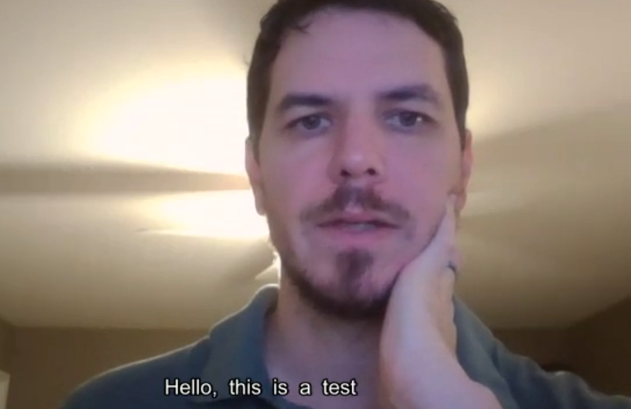
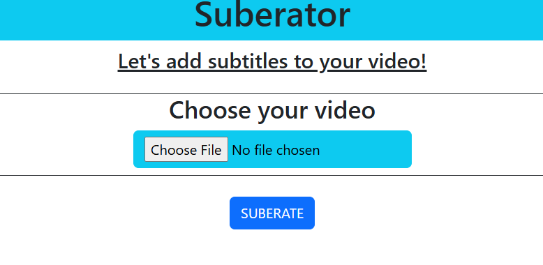
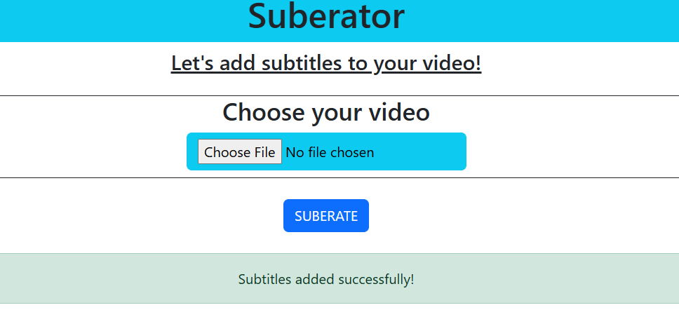
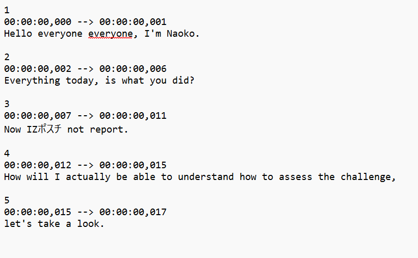

 <h1 align="center">Suberator</h1>
<h3 align="center">An AI driven subtitle generator for video.</h3>
 

<h1 align="center"> What is it?</h1>
<h3>Suberator allows a user to upload a video of their choice to automatically transcribe and add subtitles to it. </h3>

 

<h1 align="center"> Features</h1>

- <h2>Convenient and easy to use user interface</h2>
  

- <h2>Notification when process is complete</h2>

- <h2>Supports translation with numerous languages</h2>

- <h2>Outputs subtitle files</h2>

<h1 align="center"> Dependencies</h1>

  - VsCode
  - Flask
  - Python 3.8-3.11: https://www.python.org/downloads/release/python-3119/
  - Whisper by OpenAI: https://github.com/openai/whisper
  - pytorch https://pytorch.org/
  - ffmpeg https://github.com/GyanD/codexffmpeg/releases/tag/2024-10-27-git-bb57b78013
	  https://ffmpeg.org/ffmpeg.html
  - pysubs2 https://pysubs2.readthedocs.io/en/latest/
	  https://github.com/tkarabela/pysubs2?tab=readme-ov-file
  - Windows Operating System

<h1 align="center"> How to Run</h1>

  - Open a terminal in Vscode
  - Navigate to home directory (where app.py is located)
  - type python app.py
  - app will run and give you a local host address to open in browser
  - After opening that, upload a video from you computer and click suberate
  - Output files will save to files folder

